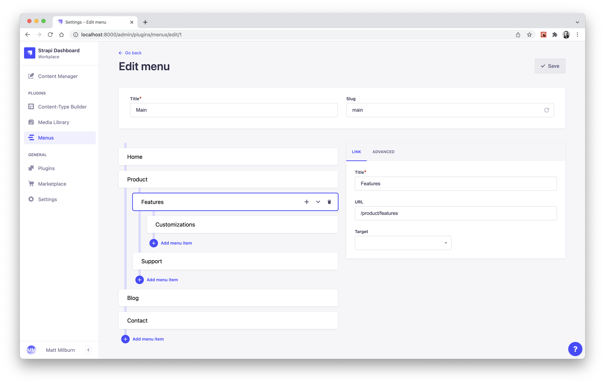

<div align="center">
  
  <h1>Strapi Menus</h1>
  <p>A plugin for Strapi CMS to customize the structure of menus and menu items.</p>
  
</div>

## Get Started

* [Features](#features)
* [Installation](#installation)
* [Configuration](#configuration)
* [User Guide](#user-guide)
* [API Usage](#api-usage)
* [Roadmap](#roadmap)

## :sparkles: Features
* Consumable menu data which can be used to render navigation and other menus in a frontend app.
* Easily manage menus with either a flat or nested structure.
* Customize the `title`, `url`, and link `target` of menu items.
* *More advanced features are currently in development.*

## :gem: Installation
```bash
yarn add strapi-plugin-menus@latest
```

## :wrench: Configuration
| property | type (default) | description |
| - | - | - |
| maxDepth | number (`null`) | Limits how deep menu items can be nested. |

*Additional options are currently in development.*

### `maxDepth`
Limits how deep menus can be nested. By default, there is no limit.

#### Example

`./config/plugins.js`

```js
module.exports = {
  'menus': {
    enabled: true,
    config: {
      maxDepth: 3,
    },
  },
};
```

## :blue_book: User Guide
TBD

## :zap: API Usage
| endpoint | description |
| - | - |
| `/api/menus` | Return all menus. |
| `/api/menus/:slug` | Return one menu based on the `slug` param, which is more intuitive than the `id` in this case. |
| `?nested` | Query string param that will serialize menu items into a nested format, otherwise they are returned as a flat list. |

#### Example
Fetch a menu with the slug "main" with the `nested` param included.

```js
await fetch( '/api/menus/main?nested' );
```

#### Response

```json
{
  "menu": {
    "id": 55,
    "title": "Main",
    "slug": "main",
    "createdAt": "2022-03-01T01:51:19.115Z",
    "updatedAt": "2022-03-01T01:55:16.153Z",
    "items": [
      {
        "id": 199,
        "title": "Home",
        "url": "/",
        "order": 0,
        "createdAt": "2022-03-01T01:51:29.237Z",
        "updatedAt": "2022-03-01T01:55:16.134Z",
        "target": null,
        "parent": null,
        "children": []
      },
      {
        "id": 201,
        "title": "About",
        "url": "/about",
        "order": 1,
        "createdAt": "2022-03-01T01:54:10.198Z",
        "updatedAt": "2022-03-01T01:55:16.134Z",
        "target": null,
        "parent": null,
        "children": []
      },
      {
        "id": 200,
        "title": "Products",
        "url": "/products",
        "order": 2,
        "createdAt": "2022-03-01T01:54:10.198Z",
        "updatedAt": "2022-03-01T01:55:16.134Z",
        "target": null,
        "parent": null,
        "children": [
          {
            "id": 204,
            "title": "Games",
            "url": "/products/games",
            "order": 0,
            "createdAt": "2022-03-01T01:54:10.206Z",
            "updatedAt": "2022-03-01T01:55:16.134Z",
            "target": null,
            "parent": {
              "id": 200
            },
            "children": []
          },
          {
            "id": 205,
            "title": "Toys",
            "url": "/products/toys",
            "order": 1,
            "createdAt": "2022-03-01T01:54:10.206Z",
            "updatedAt": "2022-03-01T01:55:16.134Z",
            "target": null,
            "parent": {
              "id": 200
            },
            "children": []
          }
        ]
      },
      {
        "id": 206,
        "title": "Contact",
        "url": "",
        "order": 3,
        "createdAt": "2022-03-01T01:55:16.134Z",
        "updatedAt": "2022-03-01T01:55:16.134Z",
        "target": null,
        "parent": null,
        "children": [
          {
            "id": 207,
            "title": "Email",
            "url": "mailto:email@example.com",
            "order": 0,
            "createdAt": "2022-03-01T01:55:16.144Z",
            "updatedAt": "2022-03-01T01:55:16.144Z",
            "target": "_blank",
            "parent": {
              "id": 206
            },
            "children": []
          },
          {
            "id": 208,
            "title": "Github",
            "url": "https://github.com",
            "order": 1,
            "createdAt": "2022-03-01T01:55:16.144Z",
            "updatedAt": "2022-03-01T01:55:16.144Z",
            "target": "_blank",
            "parent": {
              "id": 206
            },
            "children": []
          }
        ]
      }
    ]
  }
}
```

## :construction: Roadmap
* Role-based access controls (RBAC)
* Extend schema for `Menu` and `MenuItem`
* Injection zones for custom fields
* Populate `url` by selecting from list of relations.
* And of course, more!
