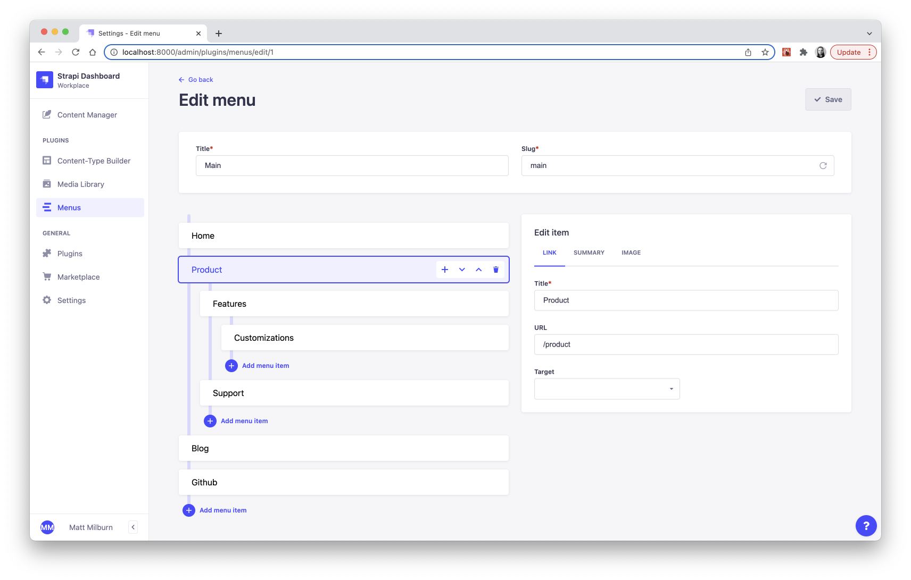
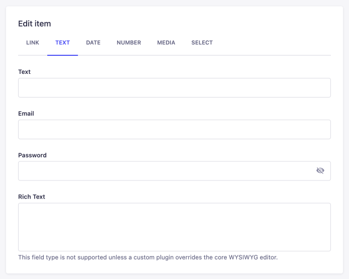
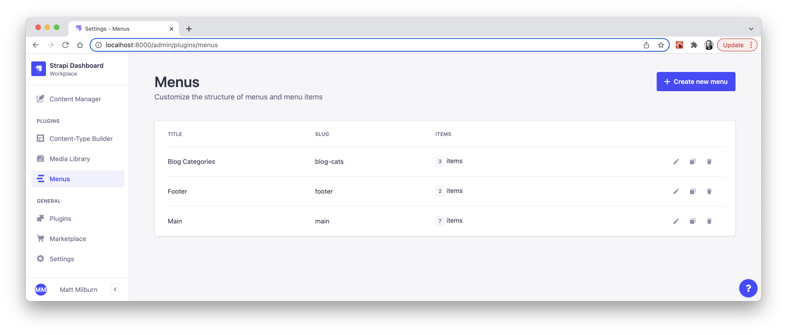
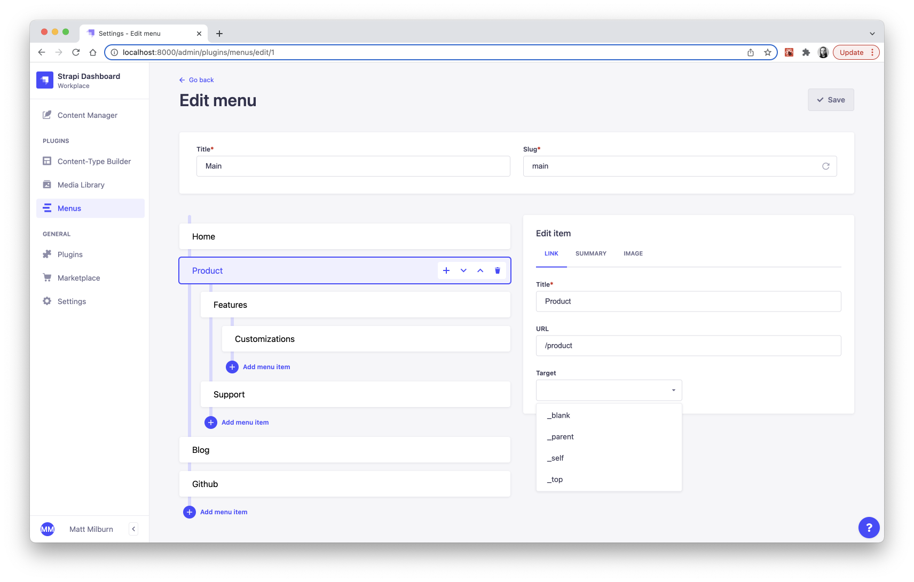

<div align="center">
  
  <h1>Strapi Menus</h1>
  <p>A plugin for Strapi CMS to customize the structure of menus and menu items.</p>
  
</div>

## Get Started

* [Features](#features)
* [Installation](#installation)
* [Configuration](#configuration)
* [Extending](#extending)
* [User Guide](#user-guide)
* [API Usage](#api-usage)
* [Troubleshooting](#troubleshooting)
* [Roadmap](#roadmap)

## <a id="features"></a>✨ Features
* Consumable menu data which can be used to render navigation and other menus in a frontend app.
* Easily manage menus with either a flat or nested structure.
* Customize the `title`, `url`, and link `target` of menu items.
* Extend the schema and UI with custom attributes and form layouts for menu items.

## <a id="installation"></a>💎 Installation
```bash
yarn add strapi-plugin-menus@latest
```

## <a id="configuration"></a>🔧 Configuration
| property | type (default) | description |
| - | - | - |
| maxDepth | number (`null`) | Limits how deep menu items can be nested. |
| layouts | object (`{}`) | Provide form layout configuration for custom fields. |

### `maxDepth`
Limits how deep menus can be nested. By default, there is no limit.

#### Example

`./config/plugins.js`

```js
module.exports = {
  menus: {
    config: {
      maxDepth: 3,
    },
  },
};
```

### `layouts`
Provide form layout configuration for custom fields. The example below is quite simple. See the [Extending section](#extending) for more details on how to use this feature.

#### Example

`./config/plugins.js`

```js
module.exports = {
  menus: {
    config: {
      layouts: {
        menuItem: {
          link: [
            {
              input: {
                label: 'Custom Field Label',
                name: 'custom_field',
                type: 'text',
              },
              grid: {
                col: 6,
              },
            },
          ],
        },
      },
    },
  },
};
```

## <a id="extending"></a>🔩 Extending

This plugin can be extended to add new attributes to the `MenuItem` schema and include editable fields for those attributes in the UI. Follow along with each section below to become familiar with this process.

### 1. Extend `MenuItem` schema attributes
First, create the file `./src/extensions/menus/strapi-server.js`. Then copy/paste the code below into that file to get started.

```js
'use strict';

module.exports = plugin => {
  // Get current `MenuItem` attributes.
  const defaultAttrs = plugin.contentTypes[ 'menu-item' ].schema.attributes;

  // Define custom attributes for `MenuItem` the same way they would be defined
  // on any other schema.
  const customAttrs = {
    custom_field: {
      type: 'string',
    },
  };

  // Extend the `MenuItem` content type with custom attributes.
  plugin.contentTypes[ 'menu-item' ].schema.attributes = {
    ...defaultAttrs,
    ...customAttrs,
  };

  return plugin;
};
```

### 2. Configure `layouts` for custom attributes
Next, we need to extend the form layout to include the new attributes we defined on the schema.

In `./config/plugins.js`, we will configure the `layouts` prop to allow our custom fields to render in the UI. By default, the menu item edit panel has one tab labeled "Link". We can add fields to the "Link" tab by defining `layouts.menuItem.link` as an array of field config objects.

New tabs in the edit panel are configured with each key in the `layouts.menuItem` object. The example below will add our custom field into the "Link" tab and it will occupy the remaining 6 columns of spacing in that panel.

```js
module.exports = {
  menus: {
    config: {
      layouts: {
        menuItem: { // This is the menu item edit panel.
          link: [ // This is the "link" tab in the menu item edit panel.
            {
              input: {
                label: 'Custom Field Label',
                name: 'custom_field',
                type: 'text',
              },
              grid: {
                col: 6,
              },
            },
          ],
        },
      },
    },
  },
};
```

### Field config and grid layout

Each field config object may contain an `input` and a `grid` prop. Neither are required, but at least one should be present.

The `input` prop requires `label`, `name`, and `type` and will be used with the [`GenericInputs`](https://github.com/strapi/strapi/tree/master/packages/core/helper-plugin/lib/src/components/GenericInput/index.js) component from the Strapi helper plugin. Other available props can be found in the example below.

The `grid` prop values correspond to a 12-column layout and will be passed directly to the [`GridItem`](https://github.com/strapi/design-system/blob/main/packages/strapi-design-system/src/Grid/GridItem.js) component from the Strapi design system.

```js
{
  input: {
    label: 'Field Label',
    name: '<field_name>', // Same name as defined in the schema.
    type: '<field_type>', // Reference "Supported field types" section.
    description: 'Helpful small text under the field input.',
    placeholder: 'Type something...',
    required: true,
    step: 60, // Numbers and time inputs only.
    options: [ // Select menus only.
      {
        label: 'Option Label 1',
        value: 'option1',
      },
      {
        label: 'Option Label 2',
        value: 'option2',
      },
      {
        label: 'Option Label 3',
        value: 'option3',
      },
    ],
  },
  grid: {
    col: 6, // Default.
    s: 12, // Tablet.
    xs: 12, // Mobile.
  },
},
```

For `select` input types, the `enum` values associated with the attribute will be used by default for the `options`. Or you can provide a custom `options` array of objects where each object has a `label` and `value` prop.

```js
[
  {
    label: 'Option Label',
    value: 'optionValue',
  },
],
```

You may also omit the `input` prop and just add some white space with the `grid` prop.

```js
{
  grid: {
    col: 6,
  },
},
```

### Supported field types
The following field types in the table below are supported. Some fields use a different type value for the schema and input type.

| Field | Schema Type | Input Type |
| - | - | - |
| Boolean | `boolean` | `bool` |
| Date | `date`, `time`, `datetime` | same |
| Email | `email` | same |
| Enumeration | `enumeration` | `select` |
| Media | `media` | same |
| Number | `integer`, `biginteger`, `decimal`, `float`  | `number` |
| Password | `password` | same |
| Relation | `relation` | same |
| Rich Text | `richtext` | `wysiwyg` |
| Text | `string`, `text` | `string`, `text`, `textarea` |

The following field types are **NOT** supported:
* Component
* Dynamic Zone
* UID
* JSON

> **NOTE:** By default, **rich text fields** are not supported unless a custom plugin overrides the core **WYSIWYG** editor, which is covered in the [Strapi guide to creating a new WYSIWYG field in the admin panel](https://docs.strapi.io/developer-docs/latest/guides/registering-a-field-in-admin.html).

### 100% Complete configuration

For reference, here is an example of a 100% complete config with all supported field types. This also demonstrates how tabs and fields can be easily configured.

First, create the file `./src/extensions/menus/strapi-server.js` and add the code below.

```js
'use strict';

module.exports = plugin => {
  // Get current `MenuItem` attributes.
  const defaultAttrs = plugin.contentTypes[ 'menu-item' ].schema.attributes;

  // Define custom attributes for `MenuItem` the same way they would be defined
  // on any other schema.
  const customAttrs = {
    example_bool: {
      type: 'boolean',
    },
    example_text: {
      type: 'string',
    },
    example_email: {
      type: 'email',
    },
    example_password: {
      type: 'password',
    },
    example_richtext: {
      type: 'richtext',
    },
    example_date: {
      type: 'date',
    },
    example_time: {
      type: 'time',
    },
    example_datetime: {
      type: 'datetime',
    },
    example_integer: {
      type: 'integer',
    },
    example_biginteger: {
      type: 'biginteger',
    },
    example_decimal: {
      type: 'decimal',
    },
    example_float: {
      type: 'float',
    },
    example_enum: {
      type: 'enumeration',
      enum: [
        'option1',
        'option2',
        'option3',
      ],
    },
    example_media: {
      type: 'media',
      allowedTypes: [ 'images' ],
      multiple: false,
    },
    example_relation_one: {
      type: 'relation',
      relation: 'oneToOne',
      target: 'api::example-one.example-one',
    },
    example_relation_many: {
      type: 'relation',
      relation: 'oneToMany',
      target: 'api::example-many.example-many',
    },
  };

  // Extend the `MenuItem` content type with custom attributes.
  plugin.contentTypes[ 'menu-item' ].schema.attributes = {
    ...defaultAttrs,
    ...customAttrs,
  };

  return plugin;
};
```

Next, add the plugin config for `menus` to `./config/plugins.js` to include custom form field layouts.

> **TIP:** Despite the simplicity, this is certainly a lot of code. It may be best to move it into a separate file and `require()` it into your main config file to keep things organized.

```js
module.exports = {
  menus: {
    config: {
      maxDepth: 3,
      layouts: {
        menuItem: {
          link: [
            {
              input: {
                label: 'Boolean',
                name: 'example_bool',
                type: 'bool',
              },
              grid: {
                col: 6,
              },
            },
          ],
          text: [
            {
              input: {
                label: 'Text',
                name: 'example_text',
                type: 'text',
              },
            },
            {
              input: {
                label: 'Email',
                name: 'example_email',
                type: 'email',
              },
            },
            {
              input: {
                label: 'Password',
                name: 'example_password',
                type: 'password',
              },
            },
            {
              input: {
                label: 'Rich Text',
                name: 'example_richtext',
                type: 'wysiwyg',
                description: 'This field type is not supported unless a custom plugin overrides the core WYSIWYG editor.',
              },
            },
          ],
          date: [
            {
              input: {
                label: 'Date',
                name: 'example_date',
                type: 'date',
              },
              grid: {
                col: 6,
              },
            },
            {
              input: {
                label: 'Time',
                name: 'example_time',
                type: 'time',
              },
              grid: {
                col: 6,
              },
            },
            {
              input: {
                label: 'Date and Time',
                name: 'example_datetime',
                type: 'datetime',
              },
            },
          ],
          number: [
            {
              input: {
                label: 'Integer',
                name: 'example_integer',
                type: 'number',
              },
              grid: {
                col: 6,
              },
            },
            {
              input: {
                label: 'Big Integer',
                name: 'example_biginteger',
                type: 'number',
              },
              grid: {
                col: 6,
              },
            },
            {
              input: {
                label: 'Decimal',
                name: 'example_decimal',
                type: 'number',
              },
              grid: {
                col: 6,
              },
            },
            {
              input: {
                label: 'Float',
                name: 'example_float',
                type: 'number',
              },
              grid: {
                col: 6,
              },
            },
          ],
          media: [
            {
              input: {
                label: 'Media',
                name: 'example_media',
                type: 'media',
              },
            },
          ],
          select: [
            {
              input: {
                label: 'Enumeration',
                name: 'example_enum',
                type: 'select',
                options: [
                  {
                    label: 'Option Label 1',
                    value: 'option1',
                  },
                  {
                    label: 'Option Label 2',
                    value: 'option2',
                  },
                  {
                    label: 'Option Label 3',
                    value: 'option3',
                  },
                ],
              },
            },
            {
              input: {
                label: 'Relation (hasOne)',
                name: 'example_relation_one',
                type: 'relation',
              },
            },
            {
              input: {
                label: 'Relation (hasMany)',
                name: 'example_relation_many',
                type: 'relation',
              },
            },
          ],
        },
      },
    },
  },
};
```

With everything configured properly, you should end up with a menu item edit panel that looks like the image below. Refer to the [Supported Field Types](#supported-field-types) section if you are still confused on how to enable the **rich text editor**.

<div align="center">
  
</div>

## <a id="user-guide"></a>📘 User Guide

### Create
On the menus plugin home page, use the "Create new menu" button to get started. You will need to provide a `title` and a unique `slug` value for the new menu. Saving the menu before adding menu items is **recommended** but not required.

### Clone
Choosing to clone an existing menu will take you to the edit view as usual, but this time it will be pre-populated with another menu's data. Once the cloned menu is saved, a brand new menu and menu items are created.

### Delete
Deleting a menu will also delete all of it's menu items.

<div align="center">
  
</div>

### Edit
When clicking on a menu item in the left column, it will reveal action buttons to move the item, delete it, or give it a submenu.

The right column will reveal the edit UI for that item, where the `title` is the only required field.

<div align="center">
  
</div>

## <a id="api-usage"></a>⚡ API Usage
**Don't forget** to enable the public `find` and `findOne` methods for `Menus` in the Users and Permissions settings.

| endpoint | description |
| - | - |
| `/api/menus` | Return all menus. |
| `/api/menus/:slug` | Return one menu based on the `slug` param, which is more intuitive than the `id` in this case. |
| `?nested` | Query string param that will serialize menu items into a nested format, otherwise they are returned as a flat list. |

#### Example
Fetch a menu with the slug "main" with the `nested` param included.

```js
await fetch( '/api/menus/main?nested' );
```

#### Response

```json
{
  "menu": {
    "id": 55,
    "title": "Main",
    "slug": "main",
    "createdAt": "2022-03-01T01:51:19.115Z",
    "updatedAt": "2022-03-01T01:55:16.153Z",
    "items": [
      {
        "id": 199,
        "title": "Home",
        "url": "/",
        "order": 0,
        "createdAt": "2022-03-01T01:51:29.237Z",
        "updatedAt": "2022-03-01T01:55:16.134Z",
        "target": null,
        "parent": null,
        "children": []
      },
      {
        "id": 201,
        "title": "About",
        "url": "/about",
        "order": 1,
        "createdAt": "2022-03-01T01:54:10.198Z",
        "updatedAt": "2022-03-01T01:55:16.134Z",
        "target": null,
        "parent": null,
        "children": []
      },
      {
        "id": 200,
        "title": "Products",
        "url": "/products",
        "order": 2,
        "createdAt": "2022-03-01T01:54:10.198Z",
        "updatedAt": "2022-03-01T01:55:16.134Z",
        "target": null,
        "parent": null,
        "children": [
          {
            "id": 204,
            "title": "Games",
            "url": "/products/games",
            "order": 0,
            "createdAt": "2022-03-01T01:54:10.206Z",
            "updatedAt": "2022-03-01T01:55:16.134Z",
            "target": null,
            "parent": {
              "id": 200
            },
            "children": []
          },
          {
            "id": 205,
            "title": "Toys",
            "url": "/products/toys",
            "order": 1,
            "createdAt": "2022-03-01T01:54:10.206Z",
            "updatedAt": "2022-03-01T01:55:16.134Z",
            "target": null,
            "parent": {
              "id": 200
            },
            "children": []
          }
        ]
      },
      {
        "id": 206,
        "title": "Contact",
        "url": "",
        "order": 3,
        "createdAt": "2022-03-01T01:55:16.134Z",
        "updatedAt": "2022-03-01T01:55:16.134Z",
        "target": null,
        "parent": null,
        "children": [
          {
            "id": 207,
            "title": "Email",
            "url": "mailto:email@example.com",
            "order": 0,
            "createdAt": "2022-03-01T01:55:16.144Z",
            "updatedAt": "2022-03-01T01:55:16.144Z",
            "target": "_blank",
            "parent": {
              "id": 206
            },
            "children": []
          },
          {
            "id": 208,
            "title": "Github",
            "url": "https://github.com",
            "order": 1,
            "createdAt": "2022-03-01T01:55:16.144Z",
            "updatedAt": "2022-03-01T01:55:16.144Z",
            "target": "_blank",
            "parent": {
              "id": 206
            },
            "children": []
          }
        ]
      }
    ]
  }
}
```

## <a id="troubleshooting"></a>💩 Troubleshooting

#### In general
Remember to **rebuild your app** after making changes to some config or other code.

```bash
yarn build
# OR
yarn develop
```

#### Custom `MenuItem` fields don't save or appear in the database table schema.
Custom fields require both the **form layout** extension as well as the **schema** extension. Please make sure both of these are configured as described in the [Extending](#extending) section.

## <a id="roadmap"></a>🚧 Roadmap
* Extra GraphQL support
* RBAC support
* Populate `url` by selecting from list of relations
* More translations
